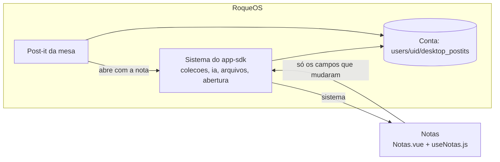

# Notas

As Notas do [RoqueOS](https://roqueos.com.br): notas em Markdown com edição, visualização e o
modo dividido, etiquetas, fixar no topo, busca, lista ou grade, exportar em `.md` ou `.txt`,
salvar nos Arquivos e IA sobre o texto. Cada nota é também um **post-it da área de trabalho**:
a mesma nota aparece na mesa do RoqueOS, e o que muda num lugar muda no outro. Nos dez idiomas
do RoqueOS.

Use de graça em [roqueos.com.br](https://roqueos.com.br), no computador, no celular e na TV.

_English below._

## Por que existe como repo

As Notas nasceram dentro do RoqueOS, que é fechado. Em 27/09/2026 elas saíram para o próprio
repositório na organização [roqueos-apps](https://github.com/roqueos-apps), o primeiro app a
guardar dados na conta, usar a IA e ser aberto por outro pedaço do sistema. O RoqueOS as
instala por uma tag, como dependência git, e elas falam com ele só pelo
[`app-sdk`](https://github.com/roqueos-apps/app-sdk). A tela é feita com o kit
[`ui`](https://github.com/roqueos-apps/ui). O mesmo código roda dentro do RoqueOS, sozinho no
navegador (`yarn dev`) e no teste.

## Arquitetura



```text
app.json            quem ela é: id permanente (notes), nome e descrição nos dez idiomas,
                    ícone, cor, janela, as capacidades e a coleção que ela abre
i18n/<idioma>.json  os textos da tela, um arquivo por idioma
src/
  index.js          definirApp: cria o app Vue próprio dentro do elemento que o RoqueOS dá
  Notas.vue         a tela: lista, editor, barra de Markdown, ajustes e confirmação
  useNotas.js       o motor: a coleção, o que cada ação grava, a IA, as preferências
  notas.js          o que não depende de tela: ordenar, filtrar, prévia, data, exportação
  markdown.js       o Markdown da pré-visualização, sempre pelo DOMPurify
  textos.js         carrega o JSON do idioma (com ?raw) e traduz uma chave
  notas.scss        o visual
dev/main.js         o yarn dev: as Notas numa janela falsa do RoqueOS
test/               Vitest: o app pelo SDK, a lógica, o Markdown e a troca de idioma
```

### Como elas falam com o RoqueOS

Só pelo `sistema` do SDK, e cada capacidade opcional está no `app.json`:

- `colecoes`: a coleção `notas`, que o RoqueOS guarda na conta da pessoa, no mesmo lugar dos
  post-its da mesa. As datas são do sistema (`criadoEm`, `atualizadoEm`).
- `ia`: o painel de IA do RoqueOS, aberto dentro do editor sobre o texto da nota. As Notas não
  veem agente nem chave; o resultado volta para a nota.
- `arquivos`: salvar a nota em Documentos, como Markdown.
- `abertura`: o post-it que abriu as Notas diz qual nota abrir (`{ nota: 'note_…' }`), e o
  próximo post-it clicado com elas abertas troca a nota.
- `idioma`, `desempenho`, `avisar`, `armazenamento` (as preferências de ordem, visualização e
  o padrão de mostrar na mesa).

### A nota é um post-it, e as duas pontas escrevem nela

O post-it da mesa é do RoqueOS e grava posição, tamanho e camada; as Notas gravam título,
texto, etiquetas, fixar e mostrar na mesa. **Cada ação das Notas manda só o campo que mudou**
(`atualizar(id, { pinned })`, nunca a nota inteira): o RoqueOS de antes gravava a nota inteira
a cada tecla e, com a nota aberta aqui, desfazia o arraste de um post-it na mesa. O teste
`app.spec.js` confere o que cada ação grava, chamada por chamada.

Nota nova nasce com os campos do post-it (posição em escada, 200×200, a camada de cima), e o
editor abre na hora: sem rede, a confirmação do sistema só chega quando ela volta. Sem conta,
criar não finge: avisa que precisa entrar.

## Pré-requisitos

- Node 22 ou mais novo (o `.nvmrc` diz 24).
- Yarn 1.22.

## Como rodar

```bash
yarn install --ignore-scripts
yarn dev          # as Notas numa janela falsa do RoqueOS, numa conta local
yarn verificar    # lint, formato, testes e app check: o mesmo do CI e do pre-push
yarn test         # só os testes
```

Na janela do `yarn dev` as notas ficam no `localStorage`, e continuam depois do F5.
`?idioma=ar-AR` abre em árabe, `?leve=1` como o aparelho fraco vê, `?convidado=1` sem conta,
e `?abertura={"nota":"note_1"}` como o post-it abre. O painel de IA aparece como um aviso no
lugar onde o do RoqueOS abriria, e salvar em Arquivos vira download.

## Contribuir

Leia o [CONTRIBUTING.md](CONTRIBUTING.md). Todo commit leva `Signed-off-by` (DCO), e o CI
confere. Falha de segurança vai pelo [SECURITY.md](SECURITY.md), nunca por issue pública.

## Créditos e licença

[MIT](LICENSE). Os ícones são do [Material Icons](https://fonts.google.com/icons)
(Apache-2.0), pelo kit de interface; veja o [ASSETS.md](ASSETS.md). O Markdown é do
[marked](https://github.com/markedjs/marked) (MIT) e a limpeza do
[DOMPurify](https://github.com/cure53/DOMPurify) (Apache-2.0 ou MPL-2.0). O nome e a marca
RoqueOS são da LEVELHARD e não fazem parte da licença.

---

## English

The Notes app of [RoqueOS](https://roqueos.com.br): Markdown notes with edit, preview and
split modes, tags, pinning, search, list or grid, export as `.md` or `.txt`, save to Files, and
AI over the text. Every note is also a **desktop sticky note**: the same note shows on the
RoqueOS desktop, and a change in one place shows in the other. In all ten RoqueOS languages.

It moved out of the closed RoqueOS core on 27/09/2026 into its own repository in the
[roqueos-apps](https://github.com/roqueos-apps) organization, the first app to keep data in
the user's account, use AI and be opened by another part of the system. RoqueOS installs it by
tag, and it talks to RoqueOS only through the `sistema` of
[`@roqueos-apps/app-sdk`](https://github.com/roqueos-apps/app-sdk): `colecoes` (the notes
collection, shared with the desktop sticky notes), `ia` (the system's AI panel inside the
editor; no agent or key reaches the app), `arquivos` (save to Documents), `abertura` (which
note to open), plus language, light profile, notices and preferences storage. Every action
writes only the field it changed, so the desktop and the app never overwrite each other.

Run `yarn install --ignore-scripts`, then `yarn dev` (a fake RoqueOS window with a local
account) or `yarn verificar` (what CI runs). Every commit must be signed off (DCO). Licensed
under [MIT](LICENSE); icons are Material Icons (Apache-2.0). The RoqueOS name and brand belong
to LEVELHARD and are not covered.
